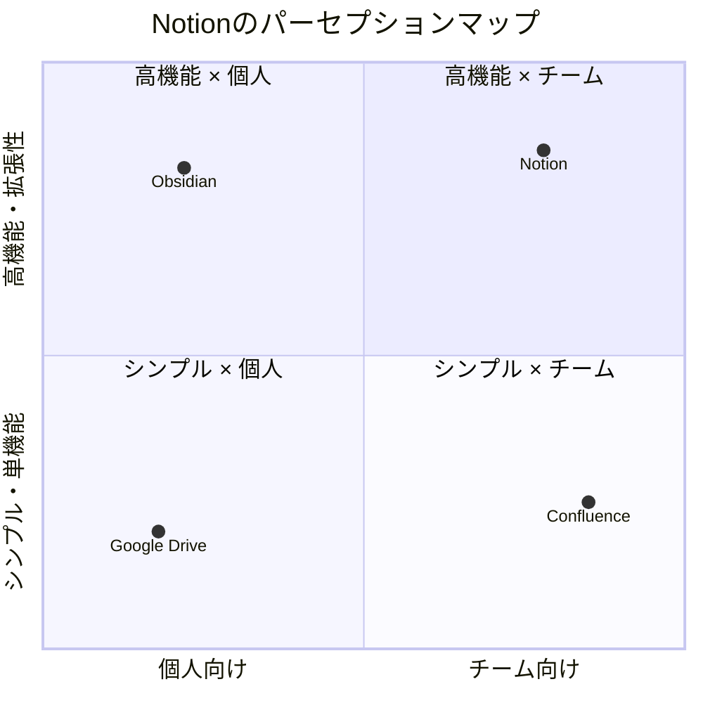
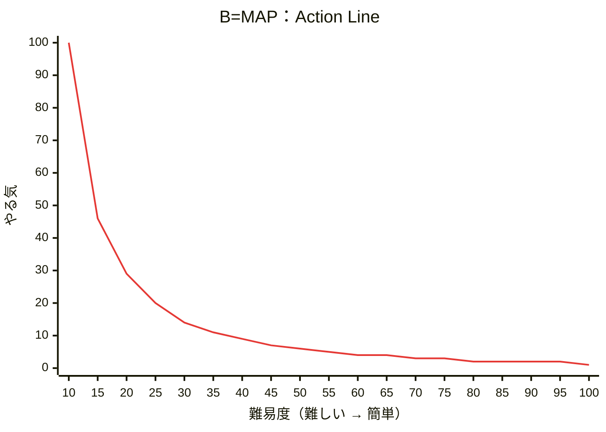

# 戦略的マーケティング：顧客に刺さる「価値」を設計する技術

マーケティングとは、単に売るためのテクニックではありません。「誰に（WHO）」「何を（WHAT）」「どのように（HOW）」届けるかを論理的に組み立て、顧客に選ばれる理由をデザインする一連のプロセスです。本資料では、戦略的な市場選定（STP）から、ユーザーの心理を動かす具体的な画面設計までを体系的に学びます。

### 1. マーケティングの根幹「WHO・WHAT・HOW」の全体像

マーケティングの成功は、ターゲットを絞り込むことから始まります。その中核を担うのが**STP分析**です。これは、膨大な市場から自社が勝てる場所を特定するための「3段階の意思決定プロセス」です。

ビジネスの目的は、優れたユーザー体験（UX）の対価として利益を得ることにあります。そのため、プロダクト設計には「企業側の都合」を排除した徹底的な**「消費者視点」**が欠かせません。「誰が、どんな課題を抱えており、自社ならそれをどう解決できるか」を定義することで、ビジネス上の戦略と実際のユーザー体験が強固に結びつきます。

**セクション末の繋ぎ:** STPという「戦略の地図」がどのように描かれるか、具体的なステップを見ていきましょう。

### 2. STP分析：市場の地図を描き、勝てる場所を選ぶ

市場を細分化し（S）、狙いを定め（T）、独自の立ち位置を築く（P）ことで、勝機のある「白地」を特定します。

### **Segmentation（セグメンテーション）：市場の細分化**

市場を共通のニーズを持つグループに切り分けます。以下の3つの軸で整理します。

| 分類軸 | 具体的な切り口（例） |
| --- | --- |
| **デモグラフィック（人口統計）** | 年齢、性別、職業、年収、居住地域 |
| **サイコグラフィック（心理）** | 価値観、ライフスタイル、抱えている悩み、こだわり |
| **行動（利用実態）** | 購入頻度、利用シーン、製品から得たい具体的な利便性 |

### **Targeting（ターゲティング）：狙うべき場所の特定**

以下の基準で、リソースを集中投下すべきセグメントを選びます。

- **市場規模:** 事業として成立する十分な顧客数がいるか。
- **競合:** 自社が埋没してしまうような強敵がいないか。
- **自社の強み:** 自社の技術や資産を最大限に活かせる場所か。

**ベネフィット:** ターゲットを絞ることで、メッセージが研ぎ澄まされ、競合に対して圧倒的な優位性を築くことが可能になります。

### **Positioning（ポジショニング）：立ち位置の定義**

選んだセグメントの顧客の頭の中に「自社をどう位置づけるか」を定義します。「〇〇といえばこのサービス」という独自の記号を植え付ける作業です。

**セクション末の繋ぎ:** では、この理論が実際の人気サービス「Notion」でどのように体現されているかを分析してみましょう。

### 3. 実践ケーススタディ：Notionの逆算STP分析

ドキュメントツールの常識を塗り替えた「Notion」の成功を、STPの視点から紐解きます。

- **Segmentation:** 「情報の散乱にストレスを感じているナレッジワーカー」という層を特定。
- **Targeting:** その中でも、特に**「情報の高密度な整理」と「高度なカスタマイズ性」を好むエンジニア、デザイナー、スタートアップ界隈**を初期ターゲットに設定しました。
- **Positioning:** 既存の単機能ツール（メモ・タスク管理）を統合した**「All-in-one workspace」**としての地位を確立しました。

### **パーセプションマップ（認識の地図）**

Notionは「白地（空きスペース）」を戦略的に占拠しています。

**セクション末の繋ぎ:** 戦略が決まったら、次はそれを「たった一人の架空のユーザー」にまで落とし込む作業に移ります。

### 4. ペルソナ設計：ターゲットを「一人の人間」に具体化する

Targetingで定めた集団を、感情や行動パターンを持つ「具体的な一人（ペルソナ）」へと具体化します。属性の羅列ではなく、**「なぜその行動をとるのか」という背景**を重視します。

### **ペルソナ例：エンジニアの「佐藤さん」**

| 項目 | 内容 |
| --- | --- |
| **名前・職業** | 佐藤 健一（32歳）、ITスタートアップのシニアエンジニア |
| **課題** | SlackやGitHubに仕様が点在し、情報の検索に「脳のリソース（Cognitive）」を浪費している。 |
| **ゴール** | チーム全員が「迷ったらここ」と言える、美しく構造化されたドキュメント基盤を作りたい。 |
| **行動パターン** | 効率を最重視する。新しいツールを試す際は、まず「自分のワークフローに適合するか」を検証する。 |

**セクション末の繋ぎ:** 明確になったペルソナを、実際の画面設計で「動かす」ための心理学的なアプローチを学びましょう。

### 5. 行動を促す設計図：Fogg Behavior Model (B=MAP) との接続

ペルソナが特定の行動（会員登録など）を起こすための条件を設計します。

### **B=MAP 理論と Action Line**

行動（Behavior）は、**Motivation（動機）× Ability（能力）× Prompt（きっかけ）**が重なった瞬間に発生します。

| 軸 | 意味 |
| --- | --- |
| 縦軸（やる気） | Motivation（動機）— 上が高い、下が低い |
| 横軸（難易度） | Ability（能力）の逆 — 左が難しい、右が簡単 |

行動が起きるかどうかは **Action Line（行動境界線）** で決まります。曲線の**上側**に入ると行動が発生します。難易度が低い（＝操作が簡単）なら、やる気が低くても Action Line を越えて行動が起きます。

### **Ability（能力）の6つの次元**

ユーザーの「Ability」を高める（＝実行の難易度を下げる）には、以下の6つの摩擦を取り除く必要があります。

1. **時間**: 短時間で完了するか
2. **お金**: 経済的負担は少ないか
3. **身体的努力**: 肉体的な手間はないか
4. **脳のサイクル（認知）**: 思考を必要としないか（★重要）
5. **社会的逸脱**: 周囲から浮かないか
6. **非習慣性**: 普段の習慣から外れていないか

### **ペルソナの特性を画面設計に繋げる**

- **「忙しいエンジニア」＝ 時間的・認知的なAbilityが低い**
    - → 入力項目を最小限にし、思考停止で進めるUIにする。
- **「失敗したくない」＝ 損失回避の動機が強い**
    - → 「クレカ登録不要」「14日間無料」を強調し、心理的負担を下げる。

**セクション末の繋ぎ:** **Fogg BMが「1回の行動（コンバージョン）」**を引き出すモデルであるのに対し、次はユーザーを**「習慣化」**させるための仕組みを学びます。

### 6. 習慣化のサイクル：Hook Modelによるプロダクトの磨き込み

一時的な行動を継続的な習慣へと昇華させるのが**Hook Model**です。

1. **Trigger（トリガー）**: 通知（外部）や、退屈・不安といった感情（内部）がきっかけとなる。
2. **Action（アクション）**: 1問解く、スクロールするなど、極めて負荷の低い行動。
3. **Variable Reward（可変的な報酬）**: 毎回異なる報酬が脳を刺激する。
    - **Hunt（狩猟）**: 価値ある情報や新しい投稿の獲得
    - **Self（自己）**: 達成感や習熟（ストリークなど）
    - **Tribe（部族）**: 他者からの承認やコネクション
4. **Investment（投資）**: データ蓄積。これが次のトリガーを強力にする。

### **事例：Duolingo**

- **Trigger**: 通知（外部）＋「学習を途切らせたくない」不安（内部）。
- **Action**: 1問だけ解く（高いAbility設計）。
- **Variable Reward**: 正解アニメーション（Self）、ランキング順位（Tribe）。
- **Investment**: 連続学習日数（ストリーク）。これが「失いたくない」という次の強力な内的トリガーに繋がる。

**セクション末の繋ぎ:** 最後に、これまでの戦略が最終的に着地する「画面の細部」であるCTAとフォームの設計原則を確認します。

### 7. 最終アウトプットへの落とし込み：CTAとフォームの最適化

戦略（STP）と心理（B=MAP）の知識は、最終的に「ボタン」と「入力欄」に凝縮されます。

### **効果的なCTA（行動喚起）の設計**

心理原則を用いてAbilityとMotivationを調整します。

- **損失回避**: 「今すぐ始めて、先行特典を確保する」
- **社会的証明**: 「エンジニア3万人が導入済み。無料で試す」
- **希少性**: 「期間限定：今だけ初月無料」

### **「Abilityを下げない」フォームUXチェックリスト**

- [ ]  **ラベルは入力欄の上に配置**: 視線の移動を最小化する。
- [ ]  **プレースホルダーでラベルを代用しない**: 入力中に何を入れるべきか忘れる「認知負荷」を防ぐ。
- [ ]  **リアルタイムエラー**: 送信ボタンを押す前、入力ミスを即座に伝える。
- [ ]  **必須項目の明示**: 「（必須）」とテキストで明記する。

### 結論

マーケティング戦略とは、高尚なドキュメントの中にだけあるものではありません。STPで定めた「誰に何を届けるか」という意志は、最終的に**「このボタン一つの文言」「この入力欄一つの置き方」**というディテールに宿ります。戦略をユーザーの行動へと変換し、真の価値を届け続けましょう。
